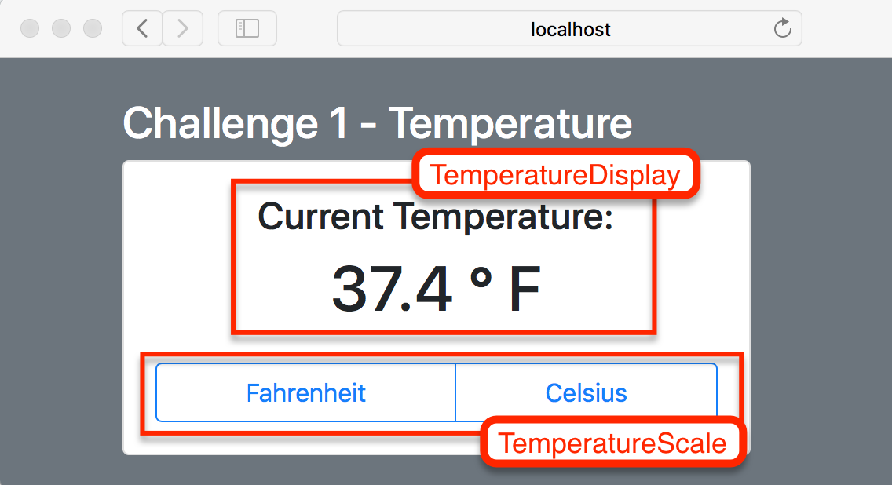

# Lifting State Up Challenges

In Visual Studio code, press `command+shift+v` (Mac) or `ctrl+shift+v` (Windows) to open a Markdown preview.

## Reason for the Challenges

As a developer, you will encounter many situations where different React components will need to share the same state. One basic way to achieve this is create a hierarchy where you "lift state up". This means that you take two or more components' shared state and move it into a shared parent component. The parent will then act as a the source of truth, passing a read-only version of the state to its children.

When you "lift state up", you create a two-way data flow:

- The parent component will pass down state and state updater callback functions as props to the children.
- The children components will then invoke the updater functions they get from their parent when they need to change their parent's state.

## Getting Started

Using your command line, you will need to navigate to the this folder, install all dependencies, and start the app.

```bash
cd exercises/08-lifting-state-up/
code . # if you would like to open this in a separate VSCode window
npm install
npm start
```

To stop the application, press `ctrl+c`.

To run the tests:

```shell
npm run test
```

If you do not see any test results, press `a` to run all tests. The tests will rerun whenever you make a change.

To stop the tests, press `ctrl+c`.

## Challenge 1 - Temperature

### User Stories

As a user, I would like to toggle the temperature between Celsius and Fahrenheit.

As an engineer, I would like to lift up state so that I can share state between different components.

### Instructions

When you start this challenge, there is only one component called "Temperature" in use. It is fully functional as it is, but you will be doing some refactoring. You will break "Temperature" up into these three different components:

1. "TemperatureScale" - this is a child component that should control the temperature scale (Celsius or Fahrenheit).
2. "TemperatureDisplay" - this is a child component that will display the current temperature in either degrees Celsius or Fahrenheit.
3. "Temperature" - this is the parent component, which will share state between its children "TemperatureScale" and "TemperatureDisplay".



The idea is that state (the scale and current temperature) should be stored in the parent "Temperature" and shared between the child "TemperatureScale" and "TemperatureDisplay" components.

### Acceptance Criteria

- "TemperatureDisplay" should display the current temperature (_CURRENT_TEMPERATURE_CELSIUS_) in either degrees "Celsius" or "Fahrenheit".
- The "TemperatureScale" component should have two buttons: a "Celsius" and "Fahrenheit" button. When one of these buttons are clicked, the temperature displayed in "TemperatureDisplay" should change to match the system of measurement that the user clicked on.
- "Temperature" should still have a `useState()` hook, where it declares "scale" and "setScale".
- "Temperature" should pass down what is needed from state ("scale", "setScale" and the current temperature) to its children "TemperatureDisplay" and "Temperature" as props.

## Challenge 2 - Address Form

### User Stories

As a user, I need to fill out a form.

As a user, I would like to see the confirmation after the form is submitted.

As an engineer, I would like to split the display of the form and form submission confirmation into two separate components so that my code is modular.

### Instructions

There are three components in this challenge:

1. "AddressForm" - has the form that the user must fill out.
2. "AddressResults" - displays what the user filled out in "AddressForm".
3. "Address" - controls which component ("AddressForm" or "AddressResults") is rendered onto the screen. It should render only one child component at a time. When the form in "AddressForm" is submitted, it should render a confirmation of what was submitted with "AddressForm".

### Acceptance Criteria

- State should be declared inside of the "Address" component.
- The "Address" component should pass down state and state updater functions to its children "AddressForm" and "AddressResults".
- The children components should update their parent's state.
- `displayResults` in "Address" should toggle what is seen on the screen. If it is false, it should show the form. If it is true, it should show the results.
  import { useState } from "react";
  import "./styles.css";
